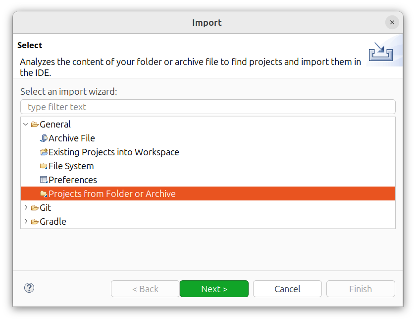
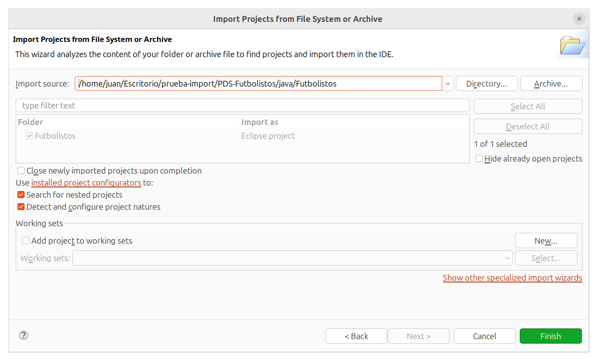

# FUTBOLISTOS

¿Eres un aficionado al fútbol y quieres repasar la historia del fútbol, sus jugadores y sus competiciones? ¡Esta es tu aplicación!
¡Sumérgete en diferentes cursos relacionados con el fútbol y demuestra que eres el más futbolero!

## Proyecto desarrollado por:

- Juan Alejandro González Ballesta

## Profesor responsable:

- Jesús Sánchez Cuadrado

## Documentación importante:

- [Casos de uso](requisitos/casos-de-uso.md).
- [Modelado de dominio](diseño/modelado/modelado_uml.png).

---

## Funcionalidad implementada:

- <u>Registro</u> y <u>login</u> de usuario.

- <u>Importación de cursos</u> en formato XML o YAML, con posibilidad de extender la funcionalidad a otros formatos soportados por la librería Jackson. (Ver fichero [info-devs](https://github.com/JuaanGB/PDS-Futbolistos/blob/main/documentacion/info-devs.md)).

- <u>Realización de cursos</u> siguiendo diferentes <u>estrategias de aprendizaje</u>. (Ver fichero [info-devs](https://github.com/JuaanGB/PDS-Futbolistos/blob/main/documentacion/info-devs.md)).

- Incorporación de <u>diferentes tipos de pregunta</u>, permitiendo añadir nuevos tipos de preguntas. (Ver fichero [info-devs](https://github.com/JuaanGB/PDS-Futbolistos/blob/main/documentacion/info-devs.md)).

- <u>Estadísticas detalladas</u> del usuario: tales como mejor racha, tiempo de uso, evolución de la racha en los últimos diez días, cursos creados y realizados... (Las estadísticas relacionadas con los cursos se actualizan al terminar el curso).

- <u>Guardar progreso</u> del curso para <u>continuarlo más adelante</u>. (Únicamente se guardará el progreso al hacer clic en "Guardar Progreso". No se guarda automáticamente al cerrar la aplicación en la ventana del curso).

- La funcionalidad extra considerada ha sido la incorporación de <u>pistas</u> para las preguntas.

- Puedes consultar el [manual de usuario](documentacion/manual-de-usuario.md) ante cualquier duda sobre el uso de la aplicación.

---

## Cómo ejecutar la aplicación:

El proyecto desarrollado en Eclipse se encuentra en la carpeta [java](java/) de este repositorio. Para importarlo y ejecutarlo hay realizar los siguientes pasos:

1. Clona este repositorio en tu máquina local:

```bash
git clone https://github.com/JuaanGB/PDS-Futbolistos/
```

2. Asegúrate de tener [Eclipse](https://www.eclipse.org/downloads/) instalado.

3. Abrir Eclipse y selecciona cualquier carpeta como espacio de trabajo (puede ser diferente de la carpeta del repositorio si lo prefieres).

4. Selecciona la opción:
   
   `File` &rarr; `Import` &rarr; `General` &rarr; `Projects from Folder or Archive`:



5. Seleccionamos la carpeta raíz del proyecto Java: `Futbolistos`.



6. Ejecutamos la clase `Lanzador.java`, ubicada en el paquete `pds.futbolistos.lanzador`.
   
   - Haciendo clic derecho sobre el fichero &rarr; `Run as` &rarr; `Java Application`.

7. ¡Disfruta de Futbolistos!
