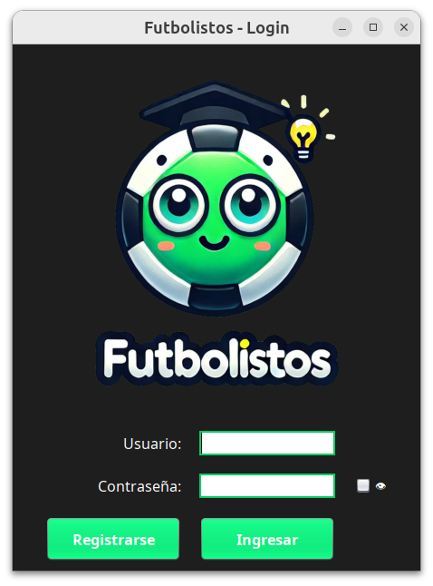
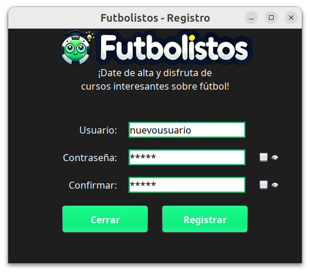
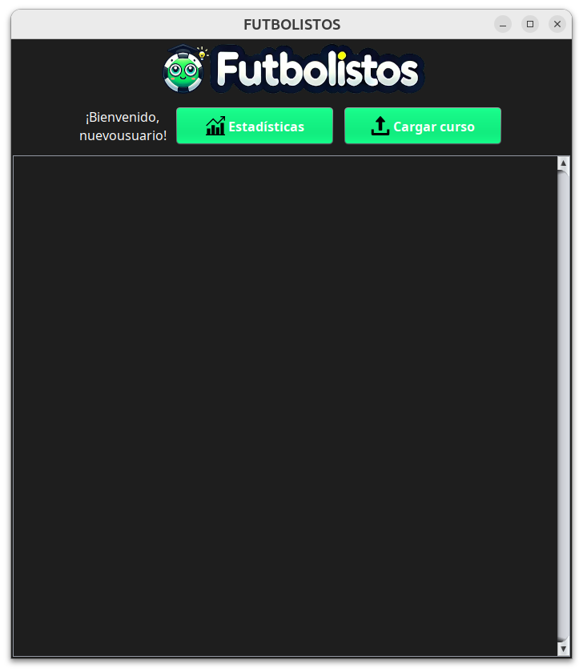
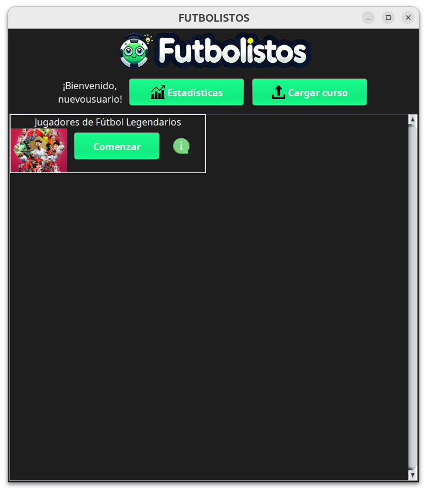
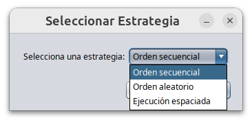
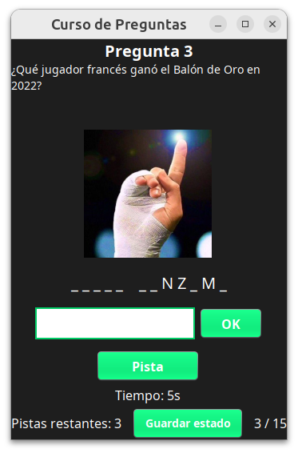
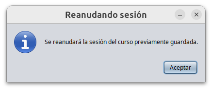
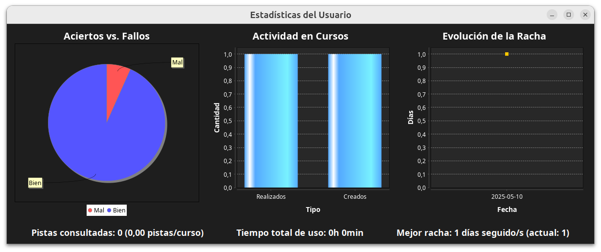

# Manual de usuario.

## Contenido

- [Login de usuarios](#login-de-usuarios)
- [Registro de usuarios](#registro-de-usuarios)
- [Ventana principal](#ventana-principal)
- [Importar curso](#importar-curso)
- [Realizar un curso / Reanudar progreso](#realizar-un-curso--reanudar-progreso)
- [Mostrar estadísticas](#mostrar-estadísticas)
- [Formato de importación de cursos](#formato-de-importación-de-cursos)
- [Ficheros de ejemplo](ficheros-de-ejemplo)

---

## Login de usuarios.

Inicialmente no dispones de una cuenta de usuario para utilizar la aplicación. Así que deberás pulsar el botón de **Registrar**.

## Registro de usuarios.

Introduciremos nuestras credenciales deseadas para la cuenta. Podemos observar la contraseña introducida clicando el botón con el icono del ojo. 

El sistema notificará si ya existe un usuario con dicho nombre o si la contraseña y su confirmación no coinciden.

## Ventana principal.

Tras el registro, deberemos introducir de nuevo nuestras credenciales de acceso en la ventana de *login*.

Desde aquí podemos cargar cursos desde ficheros o ver las estadísticas. Aunque de poco sirve ver las estadísticas si no hemos realizado ningún curso todavía.

## Importar curso.

Clicaremos el botón **Importar curso** y seleccionaremos el fichero que contiene el curso completo. Se muestran los formatos válidos en el selector de fichero.

Los ficheros de cursos deben seguir un contenido minucioso, tal y como se explica [aquí](#formato-de-importación-de-cursos).

Hemos importado correctamente el curso *Jugadores de Fútbol Legendarios*. En ese panel podemos observar el título, una foto, un botón de información que muestra la descripción del curso y un botón para **Comenzar el curso**.

## Realizar un curso / Reanudar progreso.

Si no tenemos una sesión guardada para el curso (lo cual es lo más normal si lo acabamos de importar), se preguntará acerca de la estrategia de aprendizaje que el usuario desea emplear:

Tras esto, se mostrará la primera pregunta, donde todas ellas tienen un tiempo límite para ser respondidas.

En cualquier momento del curso, podemos **guardar su estado** para retomarlo más adelante. Clicaremos el botón **Guardar estado** en el margen inferior de la ventana.

Cuando volvamos a retomarlo, no se sugerirá una estrategia de aprendizaje, sino que se le indicará al alumno que se va a retomar la sesión previamente guardada:

## Mostrar estadísticas.

Las estadísticas relacionadas con las preguntas respondidas se actualizan tras acabar el curso al completo.

Otras, como el número de cursos creados o la racha, se actualizan cuando se lleva a cabo la acción necesaria: importar un curso o iniciar sesión en el sistema, respectivamente.

Todas las estadísticas son visibles para el usuario en la ventana asociada al botón **Mostrar estadísticas** de la ventana principal.

## Formato de importación de cursos.

### Atributos necesarios para cada entidad.

Si estás considerando poner algún atributo como `null`, **no lo incluyas**.

---

**Curso**

| Atributo               | Obligatorio | Información adicional                          |
| ---------------------- | ----------- | ---------------------------------------------- |
| `nombre`               | Sí          | No puede ser una cadena vacía.                 |
| `descripcion`          | Sí          | No puede ser una cadena vacía.                 |
| `imagen_url`           | No          | Si se incluye, no puede ser una cadena vacía.  |
| `bloques_de_contenido` | Sí          | Debe contener al menos un bloque de contenido. |

---

**Bloque de contenido**

| Atributo    | Obligatorio | Información adicional                |
| ----------- | ----------- | ------------------------------------ |
| `preguntas` | Sí          | Debe contener al menos una pregunta. |

---

**Pregunta (reglas aplicables a todos los subtipos)**

| Atributo        | Obligatorio | Información adicional                                                             |
| --------------- | ----------- | --------------------------------------------------------------------------------- |
| `tipo_pregunta` | Sí          | Debe ser uno de los valores reconocidos (`flashcard`, `test`, `completar`, etc.). |
| `segundos`      | Sí          | Debe ser mayor que 0.                                                             |
| `pista`         | No          | Si se incluye, no puede ser una cadena vacía.                                     |
| `imagen_url`    | No          | Si se incluye, no puede ser una cadena vacía.                                     |

**Si `tipo_pregunta` es `flashcard`:**

| Atributo    | Obligatorio | Información adicional                    |
| ----------- | ----------- | ---------------------------------------- |
| `anverso`   | Sí          | No puede ser una cadena vacía.           |
| `reverso`   | Sí          | No puede ser una cadena vacía.           |
| `enunciado` | No          | No debe incluir un atributo `enunciado`. |

**Si `tipo_pregunta` es `completar`:**

| Atributo             | Obligatorio | Información adicional          |
| -------------------- | ----------- | ------------------------------ |
| `enunciado`          | Sí          | No puede ser una cadena vacía. |
| `respuesta_correcta` | Sí          | No puede ser una cadena vacía. |

#### **Si `tipo_pregunta` es `test`:**

| Atributo             | Obligatorio | Información adicional                                                                                 |
| -------------------- | ----------- | ----------------------------------------------------------------------------------------------------- |
| `enunciado`          | Sí          | No puede ser una cadena vacía.                                                                        |
| `respuestas`         | Sí          | Debe ser una lista con un número de elementos entre 2 y 3, y ninguno puede una cadena vacía o `null`. |
| `respuesta_correcta` | Sí          | Debe estar incluida dentro de `respuestas`.                                                           |

---

Si has seguido correctamente esta guía, el curso se importará correctamente. Si no, mostrará un mensaje de error de que hay errores en el formato.

## Ficheros de ejemplo.

En la carpeta [datos-ejemplo](../datos-ejemplo) hay dos cursos (uno en formato JSON y, el otro, en YAML) para importarlos directamente. También hay un fichero de base de datos de ejemplo.

La información de ambos ficheros está explicada [aquí](../datos-ejemplo/información.md).
